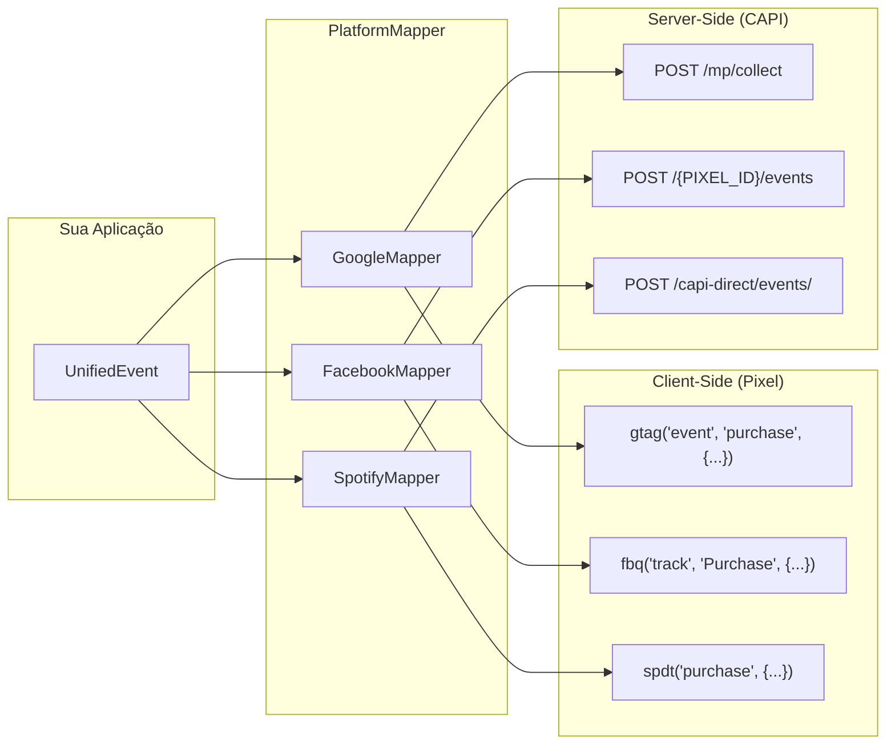

# Pattern de Mapeamento — Unified → Plataformas

Arquitetura para converter eventos da taxonomia interna para Google GA4, Facebook Meta e Spotify Ads.

## Diagrama



## Como Funciona

```typescript
// 1. Crie o evento unificado (uma vez)
const event: UnifiedPurchase = {
  event: 'purchase',
  context: {
    eventId: crypto.randomUUID(),
    timestamp: new Date().toISOString(),
    currency: 'BRL',
    sourceUrl: 'https://guicheweb.com.br/confirmacao',
    actionSource: 'web',
  },
  user: {
    email: 'cliente@email.com',
    phone: '+5511999999999',
    ip: '189.1.2.3',
    userAgent: navigator.userAgent,
    externalId: '12345',
  },
  transactionId: 'GW-50001',
  value: 150.00,
  tax: 0,
  shipping: 0,
  items: [
    { id: 'ING-1001', name: 'Rock in Rio - Pista', price: 150, quantity: 1, category: 'Shows' },
  ],
}

// 2. Converta para cada plataforma
const google = new GoogleMapper()
const facebook = new FacebookMapper()
const spotify = new SpotifyMapper()

// Client-side (Pixel)
const gPixel = google.toPixelEvent(event)
// → { eventName: 'purchase', params: { transaction_id: 'GW-50001', items: [...], value: 150 }, eventId: '...' }

const fPixel = facebook.toPixelEvent(event)
// → { eventName: 'Purchase', params: { content_ids: ['ING-1001'], value: 150, currency: 'BRL' }, eventId: '...' }

const sPixel = spotify.toPixelEvent(event)
// → { eventName: 'purchase', params: { value: 150, line_items: [...] }, eventId: '...' }

// Server-side (CAPI)
const gCapi = google.toCapiEvent(event)
// → GoogleMPRequestBody com client_id, events[{ name: 'purchase', params: {...} }]

const fCapi = facebook.toCapiEvent(event)
// → FacebookCapiServerEvent com event_name: 'Purchase', event_time: 1740912345, custom_data: {...}

const sCapi = spotify.toCapiEvent(event)
// → SpotifyCapiEvent com event_name: 'PURCHASE', event_time: '2026-03-02T10:30:00Z', event_details: { amount: 150 }
```

## Mapa de Nomes de Eventos

| Interno | Google (Pixel/CAPI) | Facebook (Pixel/CAPI) | Spotify Pixel | Spotify CAPI |
|---------|--------------------|-----------------------|---------------|--------------|
| `page_view` | `page_view` | `PageView` | `view` | — |
| `view_product` | `view_item` | `ViewContent` | `product` | `PRODUCT` |
| `add_to_cart` | `add_to_cart` | `AddToCart` | `addtocart` | `ADD_TO_CART` |
| `begin_checkout` | `begin_checkout` | `InitiateCheckout` | `checkout` | `CHECK_OUT` |
| `purchase` | `purchase` | `Purchase` | `purchase` | `PURCHASE` |
| `lead` | `generate_lead` | `Lead` | `lead` | `LEAD` |
| `sign_up` | `sign_up` | `CompleteRegistration` | `signup` | `SIGN_UP` |

## Mapa de Campos Principais

| Unified | Google | Facebook | Spotify Pixel | Spotify CAPI |
|---------|--------|----------|---------------|--------------|
| `item.id` | `item_id` | `content_ids[]` / `contents[].id` | `product_id` | — |
| `item.name` | `item_name` | `content_name` | `product_name` | `content_name` |
| `item.category` | `item_category` | `content_category` | `product_type` | `content_category` |
| `item.brand` | `item_brand` | — | `product_vendor` | — |
| `value` | `value` | `value` | `value` | `amount` |
| `eventId` | — (usa `transaction_id`) | `eventID` / `event_id` | `event_id` | `event_id` |
| `user.email` | `sha256_email_address` | `em` (SHA-256) | — | `hashed_emails[]` |
| `user.phone` | `sha256_phone_number` | `ph` (SHA-256) | — | `hashed_phone_number` |
| `timestamp` | `timestamp_micros` (µs) | `event_time` (Unix seg) | — | `event_time` (RFC 3339) |

## Como Adicionar uma Nova Plataforma

1. Crie o arquivo de interfaces da plataforma em `references/interfaces/<plataforma>/`
2. Crie `<plataforma>-mapper.ts` implementando `PlatformMapper<TPixel, TCapi>`
3. Defina `EventNameMap` com os nomes dos eventos
4. Implemente `buildPixelParams()`, `buildCapiEvent()`, `mapUserDataTo<Plataforma>()`
5. Verifique com `bunx tsc --noEmit --strict`
